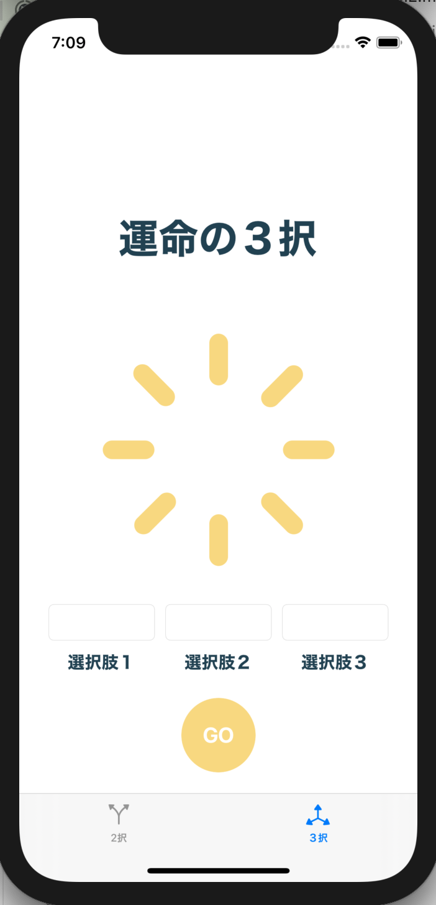

# RandomToDoApp

## 概要
`RandomToDoApp`は、「運命の分岐点」というアプリです。選択こそが運命であり、人生です。右にするか左にするか、選択に迷った時、このアプリが意思決定を手助けします。２択と３択があります。

## スクリーンショット

## 使用技術
- Swift
- UIKit
- Auto Layout
- CABasicAnimation

## インストール方法
このアプリをインストールするには、以下の手順に従ってください。

1. リポジトリをクローンします。
   git clone https://github.com/shiro-tom/RandomToDoApp-ios.git
